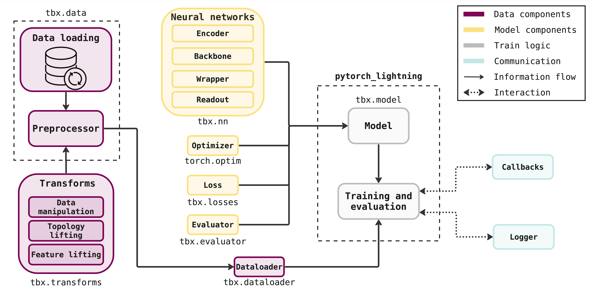

<h2 align="center">
  
</h2>

<h3 align="center">
    A Comprehensive Benchmark Suite for Topological Deep Learning
</h3>

<p align="center">
Assess how your model compares against state-of-the-art topological neural networks.
</p>

<div align="center">

[](https://github.com/pyt-team/TopoBenchmarkX/actions/workflows/lint.yml)
[](https://github.com/pyt-team/TopoBenchmarkX/actions/workflows/test.yml)
[](https://www.python.org/)
[](https://github.com/pyt-team/TopoBenchmarkX/blob/main/LICENSE)
[](https://join.slack.com/t/pyt-teamworkspace/shared_invite/zt-2k63sv99s-jbFMLtwzUCc8nt3sIRWjEw)


</div>

<p align="center">
  <a href="#overview">Overview</a> •
  <a href="#toolbox-get-started">Get Started</a> •
  <a href="https://github.com/pyt-team/TopoBenchmarkX/tree/dev/tutorials">Tutorials</a> •
  <a href="#spiral_notepad-references">References</a> 
</p>


<p align="center">
  
</p>


## Overview

`TopoBenchmarkX` (TBX) is a Python library developed to train and compare the performances of topological neural networks using different topological domains. Here, a _topological domain_ means a graph, a simplicial complex, a cellular complex, or a hypergraph.

The main pipeline trains and evaluates a wide range of state-of-the-art neural networks (see [:gear: Neural Networks](https://github.com/pyt-team/TopoBenchmarkX/blob/ninamiolane-readme/README.md#gear-neural-networks)) on numerous and varied datasets and benchmark tasks. 

Additionally, the library offers the ability to transform, i.e., _lift_, each dataset from one topological domain to another (see [:top: Liftings](https://github.com/pyt-team/TopoBenchmarkX/blob/ninamiolane-readme/README.md#top-liftings)).

## :toolbox: Get Started

### Create Environment

If you do not have conda on your machine, please follow [their guide](https://docs.anaconda.com/free/miniconda/miniconda-install/) to install it. 

First, clone the `TopoBenchmarkX` repository and set up a conda environment `tbx` with python 3.11.3. 

```
git clone git@github.com:pyt-team/topobenchmarkx.git
cd TopoBenchmarkX
conda create -n tbx python=3.11.3
```

Next, check the CUDA version of your machine:
```
/usr/local/cuda/bin/nvcc --version
```
and ensure that it matches the CUDA version specified in the `env_setup.sh` file (`CUDA=cu121` by default). If it does not match, update `env_setup.sh` accordingly by changing both the `CUDA` and `TORCH` environment variables to compatible values as specified on [this website](https://github.com/pyg-team/pyg-lib).

Next, set up the environment with the following command.

```
source env_setup.sh
```
This command installs the `TopoBenchmarkX` library and its dependencies. 

### Run Training Pipeline

Next, train the neural networks by running the following command:

```
python -m topobenchmarkx 
```

### Explore the Tutorials

To add a new dataset and benchmark task, you can explore our [tutorials](https://github.com/pyt-team/TopoBenchmarkX/tree/main/tutorials).

## :gear: Neural Networks

We list the neural networks trained and evaluated by `TopoBenchmarkX`, organized by the topological domain over which they operate: graph, simplicial complex, cellular complex or hypergraph. Many of these neural networks were originally implemented in [`TopoModelX`](https://github.com/pyt-team/TopoModelX).
## Additional details on project
<details>
<summary><b>Hierarchy of configuration files</b></summary>

```
├── configs                   <- Hydra configs
│   ├── callbacks                <- Callbacks configs
│   ├── dataset                  <- Dataset configs
│   │   ├── graph                    <- Graph dataset configs
│   │   ├── hypergraph               <- Hypergraph dataset configs
│   │   └── simplicial               <- Simplicial dataset configs
│   ├── debug                    <- Debugging configs
│   ├── evaluator                <- Evaluator configs
│   ├── experiment               <- Experiment configs
│   ├── extras                   <- Extra utilities configs
│   ├── hparams_search           <- Hyperparameter search configs
│   ├── hydra                    <- Hydra configs
│   ├── local                    <- Local configs
│   ├── logger                   <- Logger configs
│   ├── loss                     <- Loss function configs
│   ├── model                    <- Model configs
│   │   ├── cell                     <- Cell model configs
│   │   ├── graph                    <- Graph model configs
│   │   ├── hypergraph               <- Hypergraph model configs
│   │   └── simplicial               <- Simplicial model configs
│   ├── optimizer                <- Optimizer configs
│   ├── paths                    <- Project paths configs
│   ├── scheduler                <- Scheduler configs
│   ├── trainer                  <- Trainer configs
│   ├── transforms               <- Data transformation configs
│   │   ├── data_manipulations       <- Data manipulation transforms
│   │   ├── dataset_defaults         <- Default dataset transforms
│   │   ├── feature_liftings         <- Feature lifting transforms
│   │   └── liftings                 <- Lifting transforms
│   │       ├── graph2cell               <- Graph to cell lifting transforms
│   │       ├── graph2hypergraph         <- Graph to hypergraph lifting transforms
│   │       ├── graph2simplicial         <- Graph to simplicial lifting transforms
│   │       ├── graph2cell_default.yaml  <- Default graph to cell lifting config
│   │       ├── graph2hypergraph_default.yaml <- Default graph to hypergraph lifting config
│   │       ├── graph2simplicial_default.yaml <- Default graph to simplicial lifting config
│   │       ├── no_lifting.yaml           <- No lifting config
│   │       ├── custom_example.yaml       <- Custom example transform config
│   │       └── no_transform.yaml         <- No transform config
│   ├── wandb_sweep              <- Weights & Biases sweep configs
│   │
│   ├── __init__.py              <- Init file for configs module
│   └── run.yaml               <- Main config for training
```


</details>


### Graphs
| Model | Reference |
| --- | --- |
| GAT | [Graph Attention Networks](https://openreview.net/pdf?id=rJXMpikCZ) |
| GIN | [How Powerful are Graph Neural Networks?](https://openreview.net/pdf?id=ryGs6iA5Km) |
| GCN | [Semi-Supervised Classification with Graph Convolutional Networks](https://arxiv.org/pdf/1609.02907v4) |

### Simplicial complexes
| Model | Reference |
| --- | --- |
| SAN | [Simplicial Attention Neural Networks](https://arxiv.org/pdf/2203.07485) |
| SCCN | [Efficient Representation Learning for Higher-Order Data with Simplicial Complexes](https://openreview.net/pdf?id=nGqJY4DODN) |
| SCCNN | [Convolutional Learning on Simplicial Complexes](https://arxiv.org/pdf/2301.11163) |
| SCN | [Simplicial Complex Neural Networks](https://ieeexplore.ieee.org/document/10285604) |

### Cellular complexes
| Model | Reference |
| --- | --- |
| CAN | [Cell Attention Network](https://arxiv.org/pdf/2209.08179) |
| CCCN | [A learning algorithm for computational connected cellular network](https://ieeexplore.ieee.org/document/1202221) |
| CXN | [Cell Complex Neural Networks](https://openreview.net/pdf?id=6Tq18ySFpGU) |
| CWN | [Weisfeiler and Lehman Go Cellular: CW Networks](https://arxiv.org/pdf/2106.12575) |

### Hypergraphs
| Model | Reference |
| --- | --- |
| AllDeepSet | [You are AllSet: A Multiset Function Framework for Hypergraph Neural Networks](https://openreview.net/pdf?id=hpBTIv2uy_E) |
| AllSetTransformer | [You are AllSet: A Multiset Function Framework for Hypergraph Neural Networks](https://openreview.net/pdf?id=hpBTIv2uy_E) |
| EDGNN | [Equivariant Hypergraph Diffusion Neural Operators](https://arxiv.org/pdf/2207.06680) |
| UniGNN | [UniGNN: a Unified Framework for Graph and Hypergraph Neural Networks](https://arxiv.org/pdf/2105.00956) |
| UniGNN2 | [UniGNN: a Unified Framework for Graph and Hypergraph Neural Networks](https://arxiv.org/pdf/2105.00956) |

## :top: Liftings

We list the liftings used in `TopoBenchmarkX` to transform datasets. Here, a _lifting_ refers to a function that transforms a dataset defined on a topological domain (_e.g._, on a graph) into the same dataset but supported on a different topological domain (_e.g._, on a simplicial complex).

### Graph2Simplicial
| Name | Description | Reference |
| --- | --- | --- |
| CliqueLifting | The algorithm finds the cliques in the graph and creates simplices. Given a clique the first simplex added is the one containing all the nodes of the clique, then the simplices composed of all the possible combinations with one node missing, then two nodes missing, and so on, until all the possible pairs are added. Then the method moves to the next clique. | [Simplicial Complexes](https://en.wikipedia.org/wiki/Clique_complex) |
| KHopLifting | For each node in the graph, take the set of its neighbors, up to k distance, and the node itself. These sets are then treated as simplices. The dimension of each simplex depends on the degree of the nodes. For example, a node with d neighbors forms a d-simplex. | [Neighborhood Complexes](https://arxiv.org/pdf/math/0512077) |

### Graph2Cell
| Name | Description | Reference |
| --- | --- | --- |
| CellCycleLifting |To lift a graph to a cell complex (CC) we proceed as follows. First, we identify a finite set of cycles (closed loops) within the graph. Second, each identified cycle in the graph is associated to a 2-cell, such that the boundary of the 2-cell is the cycle. The nodes and edges of the cell complex are inherited from the graph. | [Appendix B](https://arxiv.org/abs/2206.00606) |

### Graph2Hypergraph
| Name | Description | Reference |
| --- | --- | --- |
| KHopLifting | For each node in the graph, the algorithm finds the set of nodes that are at most k connections away from the initial node. This set is then used to create an hyperedge. The process is repeated for all nodes in the graph. | [Section 3.4](https://ieeexplore.ieee.org/abstract/document/9264674) |
| KNearestNeighborsLifting | For each node in the graph, the method finds the k nearest nodes by using the Euclidean distance between the vectors of features. The set of k nodes found is considered as an hyperedge. The proces is repeated for all nodes in the graph. | [Section 3.1](https://ieeexplore.ieee.org/abstract/document/9264674) |

## :books: Datasets

| Dataset | Task | Description | Reference |
| --- | --- | --- | --- |
| Cora | Classification | Cocitation dataset. | [Source](https://link.springer.com/article/10.1023/A:1009953814988) |
| Citeseer | Classification | Cocitation dataset. | [Source](https://dl.acm.org/doi/10.1145/276675.276685) |
| Pubmed | Classification | Cocitation dataset. | [Source](https://ojs.aaai.org/aimagazine/index.php/aimagazine/article/view/2157) |
| MUTAG | Classification | Graph-level classification. | [Source](https://pubs.acs.org/doi/abs/10.1021/jm00106a046) |
| PROTEINS | Classification | Graph-level classification. | [Source](https://academic.oup.com/bioinformatics/article/21/suppl_1/i47/202991) |
| NCI1 | Classification | Graph-level classification. | [Source](https://ieeexplore.ieee.org/document/4053093) |
| NCI109 | Classification | Graph-level classification. | [Source](https://arxiv.org/pdf/2007.08663) |
| IMDB-BIN | Classification | Graph-level classification. | [Source](https://dl.acm.org/doi/10.1145/2783258.2783417) |
| IMDB-MUL | Classification | Graph-level classification. | [Source](https://dl.acm.org/doi/10.1145/2783258.2783417) |
| REDDIT | Classification | Graph-level classification. | [Source](https://proceedings.neurips.cc/paper_files/paper/2017/file/5dd9db5e033da9c6fb5ba83c7a7ebea9-Paper.pdf) |
| Amazon | Classification | Heterophilic dataset. | [Source](https://arxiv.org/pdf/1205.6233) |
| Minesweeper | Classification | Heterophilic dataset. | [Source](https://arxiv.org/pdf/2302.11640) |
| Empire | Classification | Heterophilic dataset. | [Source](https://arxiv.org/pdf/2302.11640) |
| Tolokers | Classification | Heterophilic dataset. | [Source](https://arxiv.org/pdf/2302.11640) |
| US-county-demos | Regression | In turn each node attribute is used as the target label. | [Source](https://arxiv.org/pdf/2002.08274) |
| ZINC | Regression | Graph-level regression. | [Source](https://pubs.acs.org/doi/10.1021/ci3001277) |

## :keyboard: Development

To join the development of `TopoBenchmarkX`, you should install the library in dev mode. 

For this, you can create an environment using either conda or docker. Both options are detailed below.

### Using Conda Environment

Follow the steps in [:toolbox: Get Started](https://github.com/pyt-team/TopoBenchmarkX/blob/ninamiolane-readme/README.md##toolbox-get-started).


### Using Docker

For ease of use, TopoBenchmarkX employs  [Docker](https://www.docker.com/). To set it up on your system you can follow [their guide](https://docs.docker.com/get-docker/). once installed, please follow the next steps:

First, clone the repository and navigate to the correct folder.
```
git clone git@github.com:pyt-team/topobenchmarkx.git
cd TopoBenchmarkX
```

Then, build the Docker image.
```
docker build -t topobenchmarkx:new .
```

Depending if you want to use GPUs or not, these are the commands to run the Docker image and mount the current directory.

With GPUs
```
docker run -it -d --gpus all --volume $(pwd):/TopoBenchmarkX topobenchmarkx:new
```

With CPU
```
docker run -it -d --volume $(pwd):/TopoBenchmarkX topobenchmarkx:new
```

Happy development!


## 🔍 References ##

To learn more about `TopoBenchmarkX`, we invite you to read the paper:

```
@misc{topobenchmarkx2024,
      title={TopoBenchmarkX},
      author={PyT-Team},
      year={2024},
      eprint={TBD},
      archivePrefix={arXiv},
      primaryClass={cs.LG}
}
```
<details>
<summary><b> More information regarding Topological Deep Learning </b></summary>
Topo{X}: a suite of {P}ython packages for machine learning on topological domains	
</details>

If you find `TopoBenchmarkX` useful, we would appreciate if you cite it!
