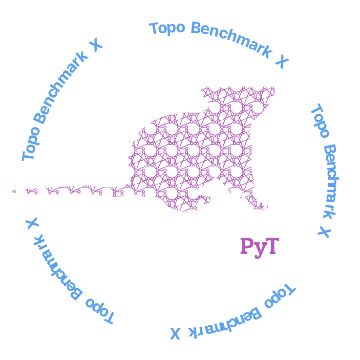

# Logos

<h2 align="center">
  

</h2>

<p align="center">
  
</p>


# :dart: TopoBenchmarkX

[](https://github.com/pyt-team/TopoBenchmarkX/actions/workflows/lint.yml)
Immediately assess how your model stacks against the state-of-the-art of topological models.

<p align="center">
  
</p>


## Topological Deep Learning

`TopoBenchmarkX` is a Python library developed to train and compare models using different topological structures.

It offers ready-to-use training pipelines to train and test a model and immediately compare its results with a wide range of models. It also supports numerous and varied datasets, and the ability to transform each dataset from one domain to another.

## :toolbox: Tutorials

## Sample Usage
### Environment
To create the environment, ensure the specified CUDA version in the env.sh file is compatible with your devices and run the following command.


```
source env.sh
```
The command above will create the conda environment named topobenchmarkx and install the TopoBenchmarkX library and its dependencies. 

### Run the model 

```
python topobenchmarkx/train.py 
```

## :gear: Models

Many of the models implemented are taken from [`TopoModelX`](https://github.com/pyt-team/TopoModelX). Here is the list of all the models implemented.

### Graphs
| Model | Reference |
| --- | --- |
| GAT | [Graph Attention Networks](https://openreview.net/pdf?id=rJXMpikCZ) |
| GIN | [How Powerful are Graph Neural Networks?](https://openreview.net/pdf?id=ryGs6iA5Km) |
| GCN | [Semi-Supervised Classification with Graph Convolutional Networks](https://arxiv.org/pdf/1609.02907v4) |

### Simplicial complexes
| Model | Reference |
| --- | --- |
| SAN | [Simplicial Attention Neural Networks](https://arxiv.org/pdf/2203.07485) |
| SCCN | [Efficient Representation Learning for Higher-Order Data with Simplicial Complexes](https://openreview.net/pdf?id=nGqJY4DODN) |
| SCCNN | [Convolutional Learning on Simplicial Complexes](https://arxiv.org/pdf/2301.11163) |
| SCN | [Simplicial Complex Neural Networks](https://ieeexplore.ieee.org/document/10285604) |

### Cellular complexes
| Model | Reference |
| --- | --- |
| CAN | [Cell Attention Network](https://arxiv.org/pdf/2209.08179) |
| CCCN | [A learning algorithm for computational connected cellular network](https://ieeexplore.ieee.org/document/1202221) |
| CCXN | [Cell Complex Neural Networks](https://openreview.net/pdf?id=6Tq18ySFpGU) |
| CWN | [Weisfeiler and Lehman Go Cellular: CW Networks](https://arxiv.org/pdf/2106.12575) |

### Hypergraphs
| Model | Reference |
| --- | --- |
| AllDeepSet | [You are AllSet: A Multiset Function Framework for Hypergraph Neural Networks](https://openreview.net/pdf?id=hpBTIv2uy_E) |
| AllSetTransformer | [You are AllSet: A Multiset Function Framework for Hypergraph Neural Networks](https://openreview.net/pdf?id=hpBTIv2uy_E) |
| EDGNN | [Equivariant Hypergraph Diffusion Neural Operators](https://arxiv.org/pdf/2207.06680) |
| UniGNN | [UniGNN: a Unified Framework for Graph and Hypergraph Neural Networks](https://arxiv.org/pdf/2105.00956) |
| UniGNN2 | [UniGNN: a Unified Framework for Graph and Hypergraph Neural Networks](https://arxiv.org/pdf/2105.00956) |

## :top: Liftings
### Graph2Simplicial
| Name | Description | Reference |
| --- | --- | --- |
| CliqueLifting | The algorithm finds the cliques in the graph and creates simplices. Given a clique the first simplex added is the one containing all the nodes of the clique, then the simplices composed of all the possible combinations with one node missing, then two nodes missing, and so on, until all the possible pairs are added. Then the method moves to the next clique. | [Simplicial Complexes](https://en.wikipedia.org/wiki/Clique_complex) |
| KHopLifting | For each node in the graph, the algorithm finds the set of nodes that are at most k connections away from the initial node. This set is then treated as if it was a clique from the CliqueLifting method. The process is repeated for all nodes in the graph. | [Neighborhood Complexes](https://arxiv.org/pdf/math/0512077) |

### Graph2Cell
| Name | Description | Reference |
| --- | --- | --- |
| CycleLifting | The algorithm finds a cycle base for the graph. Given this set of cycles the method creates a cell for each one. | [CW Complexes](https://en.wikipedia.org/wiki/CW_complex) |

### Graph2Hypergraph
| Name | Description | Reference |
| --- | --- | --- |
| KHopLifting | For each node in the graph, the algorithm finds the set of nodes that are at most k connections away from the initial node. This set is then used to create an hyperedge. The process is repeated for all nodes in the graph. | [Section 3.4](https://ieeexplore.ieee.org/abstract/document/9264674) |
| KNearestNeighborsLifting | For each node in the graph, the method finds the k nearest nodes by using the Euclidean distance between the vectors of features. The set of k nodes found is considered as an hyperedge. The proces is repeated for all nodes in the graph. | [Section 3.1](https://ieeexplore.ieee.org/abstract/document/9264674) |

## :keyboard: Development

(Introductory paragraph stating that we have 2 options, conda or docker)

### Using conda env

If you don't have conda on your machine, please follow [their guide](https://docs.anaconda.com/free/miniconda/miniconda-install/) to install it. 

We recommend using Python 3.11.3, which is the python version used to run the unit-tests. You can create create and activate a conda environment as follows:
   ```bash
   conda create -n topox python=3.11.3
   conda activate topox
   ```

Then:

1. Clone a copy of tmx from source:

   ```bash
   git clone git@github.com:pyt-team/topobenchmarkx.git
   cd topobenchmarkx
   ```

2. Install the required dependencies:

   ```bash
   bash env_setup.sh
   ```
   **Notes:**
   - Modify `install_requirements.sh` to select the proper `CUDA` and `torch` versions among the available options (`CUDA=cu121` and `torch=2.3.0` by default).
   - Please check [this website](https://github.com/pyg-team/pyg-lib) to check the combination that works best for you.

5. Ensure that you have a working tmx installation by running the entire test suite with

   ```bash
   pytest
   ```

    In case an error occurs, please first check if all sub-packages ([`torch-scatter`](https://github.com/rusty1s/pytorch_scatter), [`torch-sparse`](https://github.com/rusty1s/pytorch_sparse), [`torch-cluster`](https://github.com/rusty1s/pytorch_cluster) and [`torch-spline-conv`](https://github.com/rusty1s/pytorch_spline_conv)) are on its latest reported version.

6. Install pre-commit hooks:

   ```bash
   pre-commit install
   ```


###  Using Docker

For ease of use, TopoBenchmarkX employs [Docker](https://www.docker.com/). To set it up on your system you can follow [their guide](https://docs.docker.com/get-docker/). once installed, please follow the next steps:

First, navigate to the correct folder.
```
cd /path/to/TopoBenchmarkX
```

Then we need to build the Docker image.
```
docker build -t topobenchmark:new .
```

Depending if you want to use GPUs or not, these are the commands to run the Docker image and mount the current directory.

With GPUs
```
docker run -it -d --gpus all --volume $(pwd):/TopoBenchmarkX topobenchmark:new
```

With CPU
```
docker run -it -d --volume $(pwd):/TopoBenchmarkX topobenchmark:new
```

## :spiral_notepad: References
